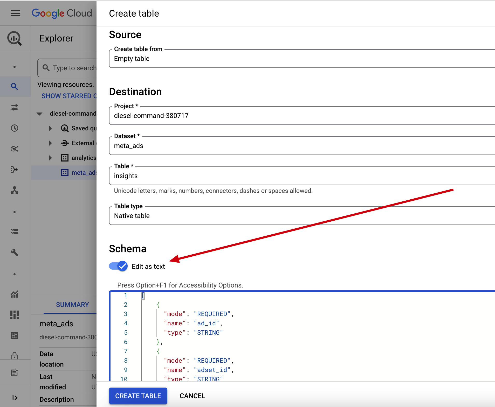
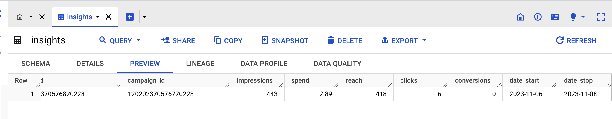

# Export Meta/Facebook Marketing API data into a BigQuery table

## Overview

This project gives you ability to export data from Facebook/Meta Business to BigQuery. 

## Init steps

**BigQuery**:

1. Create a dataset in your BigQuery project;
2. Add a table with schema provided in `insights_table.json` file;
3. Create a service account and save it as a `service-account.json` file connected to BigQuery API.

How to create a table in the UI:



**Facebook**:

1. Create a project at <https://developers.facebook.com> with enabled Marketing API

## Running

Init an env using Poetry or another tool, create own `config.py` from `config.py.example` and run the script:

```
poetry install
poetry shell

cp config.py.example config.py

python export_insights.py
```

After running the script you must see something like this:



## Final

That's it. Enjoy!

## Possible improvements

- [ ] Only one SQL query at the end
- [ ] `MERGE` operation, with staged table
